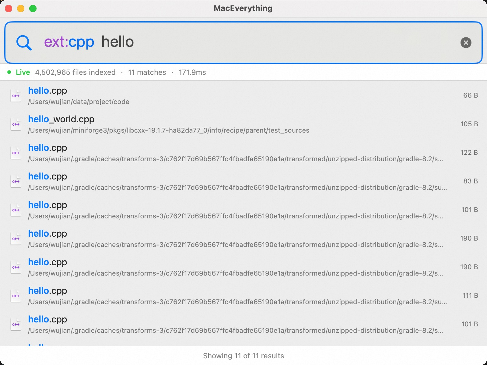

<p align="center">
  
</p>

<h1 align="center">MacEverything</h1>

<p align="center">
  <b>macOS 极速文件搜索工具</b> — 在数百万文件中毫秒级定位任意文件。<br/>
  灵感源自 Windows 上的 <a href="https://www.voidtools.com/">Everything</a>，Mac 上无出其右。
</p>

<p align="center">
  <b>中文</b> | <a href="README_EN.md">English</a>
</p>

<p align="center">
  <a href="#安装"></a>
  <a href="LICENSE"></a>
  <a href="#测试"></a>
  <a href="#mcp-集成"></a>
</p>

---

<p align="center">
  
</p>

## 为什么选择 MacEverything？

Spotlight 太慢，`find` 更慢，`mdfind` 会漏文件。MacEverything 能在数秒内索引 **整块磁盘 500 万+ 文件**，然后以 **不到 5ms** 的延迟响应每一次搜索。

| 对比项 | MacEverything | Spotlight | `find` |
|--------|:---:|:---:|:---:|
| 索引 500 万文件 | ~14 秒 | 数分钟以上 | 无索引 |
| 搜索延迟（典型值） | **< 5ms** | 200ms–2s | 5–30s |
| 实时文件系统监控 | FSEvents | FSEvents | 无 |
| 内容搜索 | Trigram 索引 | 侧重元数据 | `grep` |
| AI 工具集成 (MCP) | 内置支持 | 不支持 | 不支持 |

## 核心特性

### 极致搜索性能

- **Trigram 倒排索引** — 亚线性搜索，比暴力线性扫描快 33x–300x
- **ARM NEON SIMD** 字符串匹配 — 单线程 11.5 GB/s，多线程 74 GB/s（M3 Pro 上达到 60% 内存带宽利用率）
- **GCD 多核并行查询** — 线性扫描回退路径充分利用所有 CPU 核心
- Trigram 加速查询在 540 万文件上 **平均 < 5ms** 返回结果（[查看基准测试 →](#基准测试)）

### 全文内容搜索

- `infile:关键词` — 基于 Trigram 的全文检索，搜索结果附带关键词高亮上下文
- FNV-1a 内容哈希增量更新 — 仅重新索引变更文件
- 可配置索引的文件类型和最大文件大小

### 丰富的查询语法

兼容 Everything 风格的查询语法，内置完整 AST 解析器：

```
*.swift                      # glob 模式
ext:py size:>1mb             # 过滤器
readme path:/usr             # 路径限定搜索
"exact phrase" OR alternative   # 布尔运算符
dm:today type:folder         # 日期 & 类型过滤
case:Makefile                # 区分大小写模式
infile:TODO                  # 内容搜索
```

### 实时文件系统监控

- **FSEvents** 文件级事件监听 — 索引自动保持最新，无需轮询
- **WAL (Write-Ahead Log)** + CRC32 校验 — 崩溃安全持久化
- 启动时从上次 `eventId` 增量追赶 — 无需重建索引

### MCP 集成

内置 [Model Context Protocol](https://modelcontextprotocol.io/) 服务器 — 让 AI 编程工具即时搜索你的文件系统。

```
Claude Code / Cursor / Claude Desktop
       │
       ▼  (stdio JSON-RPC 2.0)
  MacEverythingMCP
       │
       ▼  (HTTP localhost:19860)
  MacEverything.app
```

**4 个 MCP 工具：**

| 工具 | 说明 |
|------|------|
| `search_files` | 文件名搜索（Trigram 加速） |
| `search_content` | 全文内容搜索 |
| `recent_files` | 最近修改的文件 |
| `index_status` | 索引统计与健康状态 |

支持 **Claude Code**、**Cursor**、**Claude Desktop** 一键配置 — 在应用菜单栏中切换即可。

### HTTP API

本地 REST API 监听 `localhost:19860`，方便脚本调用和自动化：

```bash
# 搜索文件
curl "http://localhost:19860/api/search?q=readme&limit=10"

# 内容搜索
curl "http://localhost:19860/api/search/content?q=TODO"

# 最近修改文件
curl "http://localhost:19860/api/recent?limit=20"

# 索引状态
curl "http://localhost:19860/api/status"
```

每次搜索响应均包含详细的 `timing` 遥测数据（totalMs、trigramMs、candidates、searchPath 等）。

## 基准测试

测试环境：macOS Darwin 24.3.0，**540 万索引文件**，48 种查询类型，经历 26 轮迭代优化：

### 搜索延迟

| 查询类型 | 平均延迟 | 示例 |
|----------|:---------:|------|
| 长关键词 (7+ 字符) | **0.1–1ms** | `screenshot` 0.1ms, `dockerfile` 0.1ms |
| 中等关键词 (4–6 字符) | **1–5ms** | `readme` 1.2ms, `config` 4.7ms |
| Glob 模式 | **0.7–18ms** | `*.cpp` 0.7ms, `*.swift` 1.5ms |
| 路径查询 | **3–32ms** | `package.json` 2.9ms |
| 全部 48 种查询 (均值) | **39.8ms** | 含边界情况和线性扫描回退 |

### Trigram vs 线性扫描

| 查询 | Trigram | 线性扫描 | 加速比 |
|------|:------:|:------:|:------:|
| `node_modules` | 0.5ms | 154ms | **308x** |
| `application` | 2.1ms | 175ms | **83x** |
| `readme` | 1.2ms | 49ms | **41x** |

### SIMD 字符串搜索 (Apple M3 Pro)

| 方法 | 吞吐量 | 对比 `std::string::find` |
|------|:------:|:------------------------:|
| `std::string::find` | 1.2 GB/s | 基准线 |
| **NEON 128-bit（单线程）** | **11.5 GB/s** | **9.5x** |
| **NEON 128-bit（12 线程）** | **74.3 GB/s** | **60.7x** |

## 技术架构

```
┌─────────────────────────────────────┐
│       SwiftUI 应用层                │  界面 · ViewModel · MVVM
├─────────────────────────────────────┤
│    Objective-C++ 桥接层             │  零开销互操作
├─────────────────────────────────────┤
│       C++20 核心引擎                │  扫盘 · 索引 · 搜索 · 持久化
└─────────────────────────────────────┘
```

### 核心引擎亮点

| 组件 | 关键设计 |
|------|---------|
| **DirectoryScanner** | 多线程工作窃取 + `getattrlistbulk` — 单次系统调用批量获取文件属性 |
| **SearchEngine** | Trigram 倒排索引 + SoA 列式布局 + `__builtin_prefetch` 缓存友好访问 |
| **ContentIndex** | 基于 Trigram 的内容倒排索引，FNV-1a 哈希增量更新 |
| **SIMDSearch** | ARM NEON 128-bit 向量化字符串匹配，2x 循环展开 |
| **IndexPersistence** | WAL + CRC32 + 分页脏页刷写 + 原子 rename |
| **FileSystemWatcher** | FSEvents 监控 + eventId 增量回放 |
| **PathTable** | 路径字符串 intern 化 — 目录路径仅存 `uint32` 索引 |
| **QueryParser** | 完整 AST 管线：Tokenizer → FilterParser → Parser → QueryAST |

### 部署模式

| 模式 | 说明 |
|------|------|
| **GUI 应用** | SwiftUI 菜单栏应用，`Option+Space` 全局快捷键 |
| **CLI 守护进程** | 无头 `maceverything-daemon` — 相同引擎，无 UI |
| **MCP 服务器** | `MacEverythingMCP` — stdio JSON-RPC 代理，供 AI 工具调用 |

## 安装

### 下载 DMG（推荐）

1. 从 [Releases](../../releases) 下载 `MacEverything.dmg`
2. 将 `MacEverything.app` 拖入「应用程序」文件夹
3. 启动后按提示授予 **完全磁盘访问权限**
4. 等待初始扫描完成（典型磁盘约 14 秒）
5. 按 `Option+Space` 开始搜索

### 从源码构建

**环境要求：** macOS 13+，Xcode 15+

```bash
# 克隆
git clone https://github.com/user/MacEverything.git
cd MacEverything

# 构建
xcodebuild -project MacEverything.xcodeproj -scheme MacEverything \
  -configuration Release build SYMROOT=build

# 打包 DMG
hdiutil create -volname MacEverything \
  -srcfolder build/Release/MacEverything.app \
  -ov -format UDZO MacEverything.dmg
```

### CLI 守护进程

```bash
make daemon
./maceverything-daemon --port 19860 --root /
```

## 测试

77 个测试模块覆盖完整技术栈 — 从 Trigram 索引正确性到 MCP 协议一致性。

```bash
make test          # 快速单元测试 + 桥接层 lint
make test-slow     # 集成测试（全盘扫描、FSEvents、端到端）
make test-all      # 全部测试
make test-asan     # AddressSanitizer 检测
make test-tsan     # ThreadSanitizer 检测
```

测试覆盖范围：
- **核心引擎**：扫描、查询、变更、压缩、排序、路径搜索
- **持久化**：WAL CRC 完整性、批量回放、竞态条件、分页持久化
- **内容索引**：Trigram、压缩、修改时间跟踪、WAL 跟踪
- **搜索/查询**：分词器、解析器、过滤器、日期过滤、结构化查询、正则 Trigram
- **性能**：SIMD 搜索、1000 万条记录合成基准、Trigram 竞争测试
- **集成**：线程安全、端到端、HTTP 引擎热替换、MCP 协议（29 项断言）
- **内存安全**：ASan + TSan 构建检测内存和线程问题

## 使用方式

1. **授予完全磁盘访问权限** — 应用首次启动时会引导你完成设置
2. **等待初始扫描** — 进度在菜单栏显示（典型磁盘约 14 秒）
3. **`Option+Space`** — 随时随地唤出搜索窗口
4. **输入关键词搜索** — 搜索结果即时呈现
5. **`infile:关键词`** — 切换到全文内容搜索
6. **右键菜单** — 打开、在 Finder 中显示、复制路径、拖放

### 查询示例

| 查询 | 查找结果 |
|------|---------|
| `readme` | 所有文件名包含 "readme" 的文件 |
| `*.swift` | 所有 Swift 源文件 |
| `ext:py size:>1mb` | 大于 1MB 的 Python 文件 |
| `dm:today` | 今天修改过的文件 |
| `config path:/usr` | `/usr` 目录下包含 "config" 的文件 |
| `infile:TODO ext:cpp` | 内容包含 "TODO" 的 C++ 文件 |
| `type:folder node_modules` | 名为 "node_modules" 的目录 |

## 项目结构

```
MacEverything/
├── Core/                  # C++20 核心引擎
│   ├── SearchEngine       # Trigram 索引 + 并行查询（5 个 .cpp 文件）
│   ├── DirectoryScanner   # 多线程批量扫描器
│   ├── ContentIndex       # 全文倒排索引
│   ├── IndexPersistence   # WAL + 分页持久化
│   ├── FileSystemWatcher  # FSEvents 实时监控
│   ├── HttpServer         # 内嵌 REST API 服务器
│   ├── SIMDSearch         # ARM NEON 向量化搜索
│   ├── QueryAST/Parser    # 完整查询语言管线
│   ├── PathTable          # 字符串 intern 表
│   └── ServiceEngine      # 生命周期编排
├── Bridge/                # Objective-C++ 桥接层
│   └── MacSearchBridge    # C++ ↔ Swift 零开销互操作
├── App/                   # SwiftUI 应用层
│   ├── ContentView        # 主搜索界面
│   ├── SearchViewModel    # MVVM + 分级防抖
│   ├── HotkeyManager      # 全局快捷键注册
│   └── MCPConfigManager   # MCP 一键配置
├── CLI/                   # 命令行工具
│   ├── daemon_main        # 无头守护进程
│   └── mcp_main           # MCP 服务器（stdio JSON-RPC）
└── tests/                 # 77 个测试模块
```

## 性能设计

| 技术 | 效果 |
|------|------|
| `getattrlistbulk` | 单次系统调用批量获取文件属性 — 避免逐文件 `stat` |
| Trigram 倒排索引 | 亚线性搜索：比线性扫描快 33x–300x |
| SoA 列式布局 | 缓存友好的内存访问模式，提升过滤效率 |
| `__builtin_prefetch` | 隐藏候选验证阶段的随机内存访问延迟 |
| ARM NEON SIMD | 128-bit 向量化字符串匹配，单线程加速 9.5x |
| GCD 并行扫描 | Trigram 无法加速时启用多核线性扫描 |
| PathTable intern 化 | 目录路径仅存 `uint32` 索引 — 大幅节省内存 |
| Generation 计数器 | 快速输入时每 1024 次迭代自动取消过时查询 |
| APFS Firmlink 去重 | 正确处理 macOS Data/System 卷合并产生的目录环路 |
| Thread-local 位图 | 内容索引 Trigram 提取 O(1) 去重（2^24 位） |
| 自适应 Trigram 旁路 | 当 Trigram 选择性差时自动回退并行扫描 |
| 80ms/300ms 分级防抖 | 平衡 UI 响应速度与资源消耗 |

## 参与贡献

欢迎贡献代码！请遵循以下流程：

1. Fork 本仓库
2. 创建功能分支 (`feat/...`) 或修复分支 (`fix/...`)
3. 为新功能编写测试
4. 确保 `make test-all` 通过
5. 提交 Pull Request

## 许可证

本项目基于 MIT 许可证开源 — 详见 [LICENSE](LICENSE) 文件。

---

<p align="center">
  <b>如果 MacEverything 让你找文件更快了，请给一颗 Star 支持！</b>
</p>
